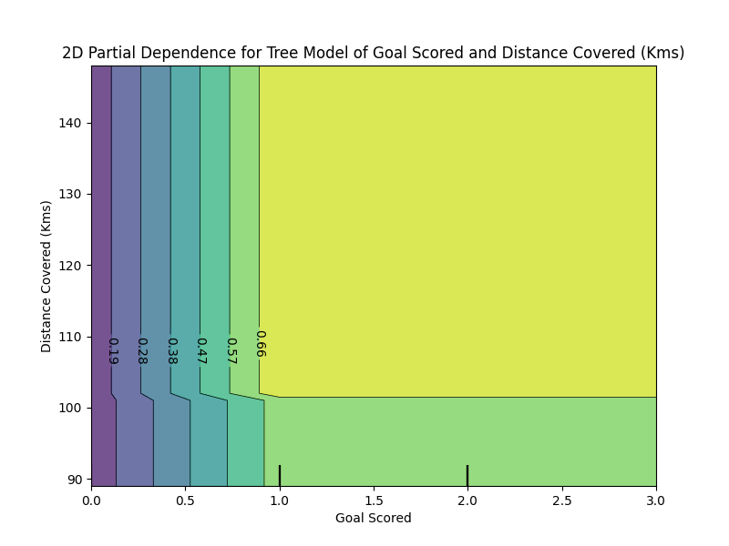
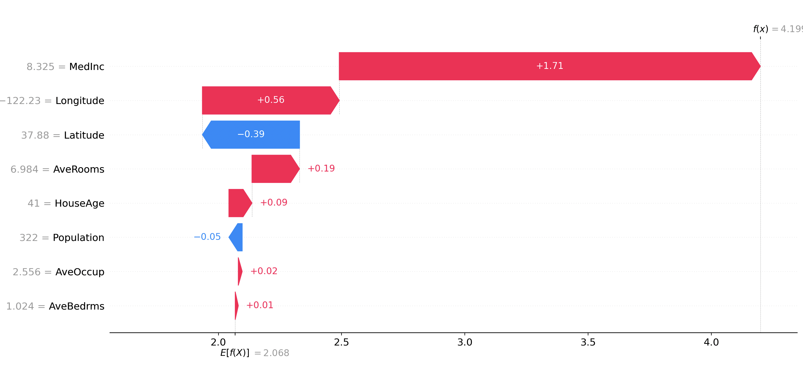
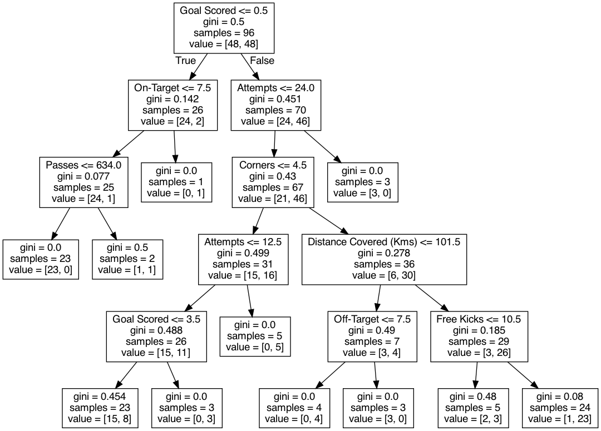

# Machine Learning Interpretability

## Partial Depedence Plots (PDP)

Partial Dependence Plots (PDPs) help visualize how one or two features influence a model’s predictions while averaging out other variables. They are useful for identifying non-linear relationships and feature interactions in machine learning models. 1D PDPs show the effect of a single feature, while 2D PDPs reveal interactions between two features. PDPs provide interpretability by illustrating how changes in input variables impact the target outcome.

- This 2D Partial Dependence Plot shows how Goals Scored and Distance Covered (Kms) affect the probability of winning the “Man of the Match” award. 
- The color gradient indicates the predicted probability, where darker blue means lower probability and lighter yellow means higher probability. The plot reveals that scoring at least one goal significantly increases the probability, while running more distance alone has little impact unless combined with scoring.

## **Permutation Importance in Machine Learning**

Permutation Importance is a technique used to evaluate the impact of each feature on a trained model’s predictions. It works by **randomly shuffling** a single feature across all samples, breaking its relationship with the target, and measuring the resulting drop in model performance. Features that cause a significant decrease in performance are considered **more important**.

### **Why is Permutation Importance Useful?**
- **Model-Agnostic**: Works with any model (Random Forest, Neural Networks, etc.).
- **Handles Feature Interactions**: Unlike feature importance from tree-based models, permutation importance accounts for dependencies between variables.
- **Easy to Interpret**: Higher importance values indicate stronger influence on predictions.

---

### **Understanding the Example Output**

| **Feature** | **Importance** |
|------------|--------------|
| **Goal Scored** | **0.12500** (Most important) |
| **Distance Covered (Kms)** | 0.05000 |
| **Free Kicks** | 0.05000 |
| **On-Target** | 0.03125 |
| **Ball Possession %** | 0.03125 |

- **Goals Scored is the most influential feature** in predicting the “Man of the Match” award.
- **Distance Covered (Kms)** and **Free Kicks** also contribute, but less significantly.
- **Offsides, Corners, Yellow & Red cards, and Goals in PSO have no impact**, meaning they do not influence the model’s decision.
- **Negative importance values** (e.g., **Passes = -0.05625**) suggest potential noise or correlation issues.

## Shap Values

SHAP (Shapley Additive explanations) is an advanced interpretability technique that helps explain the impact of each feature on a machine learning model's predictions.

- Consistent and Fair: Ensures that features with higher contributions are always ranked higher.

- Model-Agnostic: Works with any model (XGBoost, LightGBM, Random Forests, Deep Learning, etc.).

- Local and Global Interpretability:

    - Local: Explains individual predictions (e.g., why a model predicted a certain value for a single instance).

    - Global: Aggregates feature contributions to provide an overall view of feature importance.

- Handles Feature Interactions: Unlike other techniques, SHAP values can capture interactions between features.

### Understanding Waterfall Plot

The SHAP waterfall plot breaks down a single prediction by showing how each feature pushes the output higher or lower compared to the base value (expected prediction across all data).

- Positive SHAP values (red bars) indicate features that increase the prediction.

- Negative SHAP values (blue bars) indicate features that decrease the prediction.

- The base value (E[f(X)]) represents the model's average prediction if no feature information was available.

- Final prediction (f(x)) is obtained by summing all SHAP contributions starting from the base value.

#### Key Takeaways from the Plot

- MedInc (Median Income) has the strongest positive effect, significantly increasing the prediction.

- Latitude has the strongest negative effect, lowering the prediction.

- The combination of all features explains why this particular instance’s prediction is higher or lower than the base value.

SHAP provides a clear, quantitative understanding of how models make decisions, making them more transparent and interpretable.
## Shap Tree Explainer

The SHAP Tree Explainer is a specialized SHAP method designed for tree-based models like XGBoost, LightGBM, and Random Forests. It efficiently calculates SHAP values, showing how each feature contributes to a model’s prediction.

This decision tree represents how different features influence a classification model.

- At each split, the dataset is divided based on the feature threshold, aiming to reduce impurity (gini score).
- “Goal Scored” is the most important splitting criterion at the root, indicating that scoring goals strongly influences predictions.
- Lower down, other features like On-Target, Attempts, Distance Covered, and Passes refine the decision-making process.
